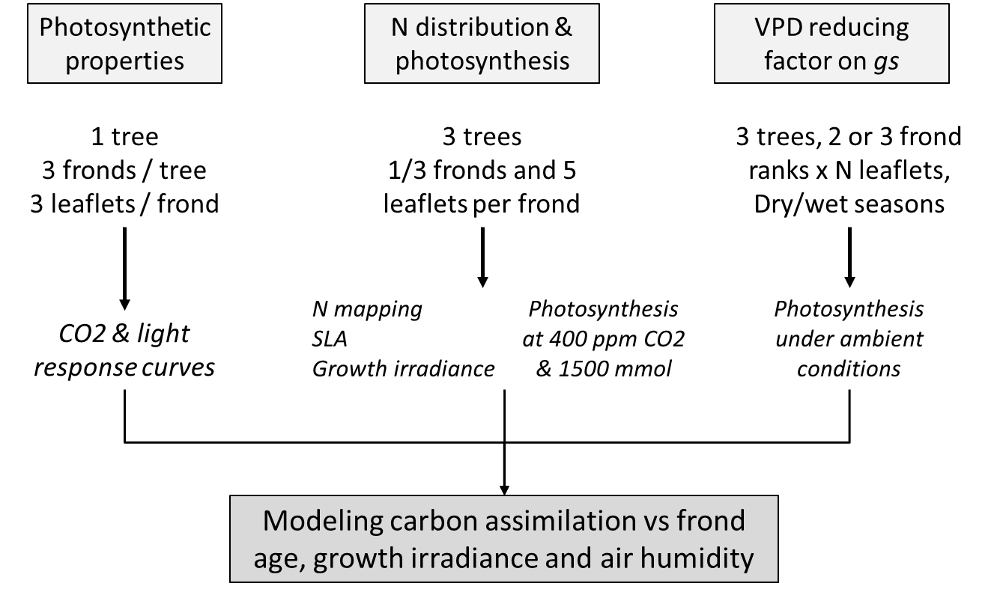
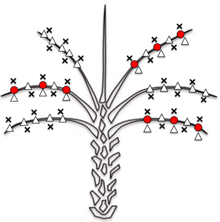

```{r setup, include=FALSE}
knitr::opts_chunk$set(echo = TRUE, warning = FALSE, message = FALSE)
library(tidyverse)
library(data.table)
source("1-code/helpers.R")
```

# Introduction

This study is part of the PalmStudio project. It is designed to parameterize the Farquhar model from ARCHIMED to simulate the leaf photosynthesis, while considering the nitrogen content effect on the photosynthesis. 

The nitrogen content is often higher in young leaves compared to old ones because the plants re-mobilize. This study was done to help better understand the nitrogen distribution on the leaves according to their rank (a proxy of leaf age), and its effect on photosynthesis rate. 

This study is divided in three main steps: 



1. Photosynthesis properties, with detailed photosynthesis analysis to calculate farquhar parameters: Vcmax, Jmax, and TPU. The measurements include	a CO2 curve and RD curve along with the nitrogen content of the leaflet. This will be done on 3 leaflet positions along the leaf for three leaves (i.e. 9, 17, 25) on one palm from each progeny. The leaflet positions will correspond to:   
    * Position 1: point `a`;  
    * Position 2: point `b`;  
    * Position 3:  on the middle between point `b` and `c` (`1/2 bc`).  

2. Mapping nitrogen and photosynthesis distribution in the palm tree. The objectives being to map and derive a relationship for the nitrogen content and its effect on photosynthesis activity on different frond ages. The method will be to choose 3 palms on each progeny, and make “snap” photosynthesis measurement and nitrogen sampling. Photosynthesis measurements have been done in controlled conditions at light saturation (CO2: 400 umol m-2 s-1; PAR: 1500 umol m-2 s-1; RH: +/- 70%; T = 28 celsius degree). Measurements have been done on every 3 leaf rank (i.e. 2, 5, 8, 11, 14, 17, 20, 23, 26, 35, 38, 41, 44, 47, 50), and on 5 leaflet positions along the leaf: at position `a`, between `a` and `b` (ab), at `b`, at one fourth of the distance between `b` and `c` (1/4 bc), and at half the distance between `b` and `c` (1/2 bc). 



> Figure 2: Protocol for mapping photosynthesis and nitrogen. Triangles indicate the location of “snap” measurements of photosynthesis, SPAD, and leaf sampling for nitrogen analysis. Red circles indicate the location of detailed photosynthesis measurements (CO2 and light curves).

There is also a third step wich consists on measuring the photosynthesis at saturated light under different vapor pressure deficit (VPD). This work is done in [another document](Gs_medlyn.html). 


# N Mapping

The N mapping is the second part of the "Photosynthesis measurement protocol" from PalmStudio. It consists on measuring the distribution of the nitrogen content along with the photosynthesis rate on three leaflets on three palms for each of the two different progenies.  

## Reading the data

The data comes from a LiCOR 6400. The table we import here was extracted from the outputs of the instrument.

```{r}
df=
  fread(input = "0-data/Nassimilationmapping.csv", data.table = FALSE)%>%
  rename(Ncontent= `N(%)`)
df$Position= factor(df$Position, levels= c("1/2 bc", "1/4 bc", "b", "ab", "a"))
```


## N content ~ leaf rank + leaflet position for each palm

The N content of the leaf is highly heterogeneous depending on the leaflet position on young leaves (rank < 10), with higher concentration found at the tip. It seems more homogeneous for mature leaves though. 

```{r}
df%>%
  filter(Rank != 26)%>%
  group_by(Palm, Rank,`Position nb`)%>%
  na.omit()%>%
  ggplot(aes(x= Rank, y= Ncontent, color = `Position nb`))+
  geom_line(aes(group = `Position nb`))+
  geom_point(aes(group = `Position nb`))+
  geom_smooth(method = "lm")+
  facet_wrap(vars(Palm), nrow = 1)+
  ylab("N content (%)")+
  xlab("Leaf rank")+
  ggtitle("Effect of rank and leaflet position on leaf N content for each palm")
```

The N content steadily decrease with increase leaf age, from more than 3% for young leaves down to around 2% for the older (~ rank 50). The maximum and minimum values depend on the palm, and the slope too. This is a well known effect that is due to nitrogen remobilization from old leaves to younger leaves.

## N content according to leaf rank, all palms

Let's investigate if we can find a general rule for the effect of the rank on leaf nitrogen content:  

```{r}
ggplot(data= df, aes(x= as.factor(Rank), y= Ncontent))+
  geom_boxplot(notch = TRUE)+
  ylab("N content (%)")+
  xlab("Leaf rank")+
  facet_grid(vars(Progeny))+
  ggtitle("Effect of Rank (a proxy for age) on N content of the leaf")
```

The nitrogen content decrease with increasing leaf rank, which is itself a proxy for leaf age. The same effect is observed for both progenies (progeny 5, up and progeny 6, down).

## Modelling N distribution

Now that we have a better understanding of the effect of leaf age on N content, we can make a simple model to predict the trend between leaves in the palm tree.

As the leaflet position did not appear to have any effect on the nitrogen content, we will fit a linear model directly using leaf rank:

```{r}
lm_Ncont_rank= lm(formula = Ncontent~Rank, data = df)
```

Once fitted we can compare our model fit to the data: 
```{r}
coef_Ncont_rank= coef(lm_Ncont_rank)
df$Ncontent_sim= coef_Ncont_rank[1] + coef_Ncont_rank[2] * df$Rank
ggplot(data= df, aes(x= Rank))+
  geom_point(aes(y= Ncontent, color= "Measured"))+
  geom_line(aes(y= Ncontent_sim, color= "Simulated"), lwd= 2)
```

As we can see on the plot above, our simple linear model is able to predict the trend of the loss of nitrogen content with increasing rank.

The equation of the model is: 

```{r echo=FALSE, results='asis'}
print_equation(model = lm_Ncont_rank, latex = TRUE, scientific= FALSE)
```

# N content effect on photosynthesis

The "snap" measurements for photosynthesis were measured for several leaf ranks. Let's investigate the effect of the rank:  

```{r}
ggplot(data= df, aes(x= as.factor(Rank), y= Photo))+
  geom_boxplot(notch = TRUE)+
  ylab("Photosynthesis (umol m-2 s-1)")+
  xlab("Leaf rank")+
  facet_grid(vars(Progeny))+
  ggtitle("Effect of Rank (a proxy for age) on photosynthesis for each progeny")
```

The figure above shows clearly that photosynthesis decrease with increasing leaf rank for both progenies, as for the nitrogen content.

## Photosynthesis according to leaflet position and leaf rank for each palm

The photosynthesis was measured on five leaflets with different positions along the leaf. Similar to what we found with nitrogen content, the leaflet position influence the photosynthesis. This seems to be corelated to the nitrogen content. The leaf ran has a similar effect too.

```{r}
df%>%
  group_by(Palm, Rank,`Position nb`)%>%
  na.omit()%>%
  ggplot(aes(x= Rank, y= Photo, color = `Position nb`))+
  geom_line(aes(group = `Position nb`))+
  geom_point(aes(group = `Position nb`))+
  geom_smooth(method = "lm")+
  facet_wrap(vars(Palm), nrow = 1)+
  ylab("Photosynthesis (umol m-2 s-1)")+
  xlab("Leaf rank")+
  ggtitle("Effect of rank and leaflet position on photosynthesis for each palm")
```

The figure above shows the position of the leaflet on the leaf can influence the photosynthesis, with a maximum rate at point `b` in average, and lower going to the tip (point `a`) or the half-distance between `b` and `c` (`1/2 bc`).

## Photosynthesis according to nitrogen content

The photosynthesis activity at light saturation should be related to the nitrogen content of the leaflet.  

```{r}
ggplot(data= df, aes(x= Ncontent, y= Photo, color= Rank))+
  geom_point()+
  scale_color_viridis_c()+
  facet_grid(vars(Progeny))+
  ylab("Photosynthesis (umol m-2 s-1)")+
  xlab("N content (%)")+
  ggtitle("Effect of the leaflet N content on photosynthesis according to leaf rank")
```

The plot above summarises well the relationship between leaf rank, nitrogen content, and photosynthesis rate at light saturation. It shows that nitrogen content is higher for leaves with low rank (young leaves), and that photosynthesis is higher with high nitrogen content.

For the moment, we only need a simple model to start with, so we will only use the nitrogen content of the leaf to correct the photosynthesis rate for all leaflets of the leaf.


## Modelling photosyntesis correction with N

ARCHIMED simulates the photosynthesis using the Farquhar model. The data we have currently only allows us to relate photosynthesis at saturation with nitrogen content. 

To compute a correction coefficient, we need to normalize the photosynthesis first.
```{r}
df$RelA= 
  (df$Photo-min(df$Photo, na.rm = TRUE)) / 
  (max(df$Photo, na.rm = TRUE) - min(df$Photo, na.rm = TRUE))
```

The simple linear model only relates the normalized photosynthesis to the N content. 
```{r}
lm_A_Ncont= lm(formula = RelA~Ncontent, data = df)
```


```{r}
coef_A_Ncont= coef(lm_A_Ncont)
df$RelA_sim= coef_A_Ncont[1] + coef_A_Ncont[2] * df$Ncontent
ggplot(data= df, aes(x= Ncontent))+
  geom_point(aes(y= RelA, color= "Measured"))+
  geom_line(aes(y= RelA_sim, color= "Simulated"), lwd= 2)+
  xlab("N content (%)")+
  ylab("Photosynthesis (umol m-2 s-1)")+
  guides(color = guide_legend(title = "origin"))
```

As we can see on the plot above, our simple linear model is able to predict the trend of the increase of the normalized photosynthesis with increasing nitrogen content.

The equation of the model is: 

```{r echo=FALSE, results='asis'}
print_equation(model = lm_A_Ncont, latex = TRUE, scientific= FALSE)
```

where RelA is the normalized photosynthesis (i.e. relative assimilation).

# Next steps

The next steps of the protocol will allow us to compute the effect of nitrogen content directly on the Farquhar parameters once we get the response curves according to the nitrogen content of the leaflet.